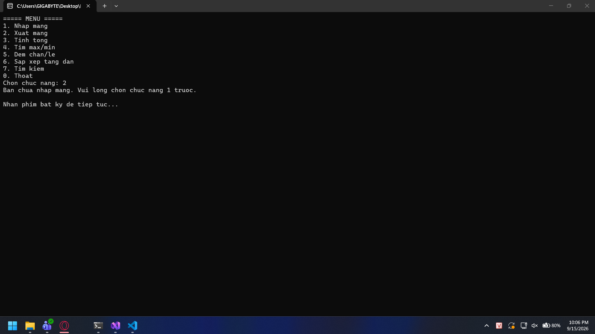
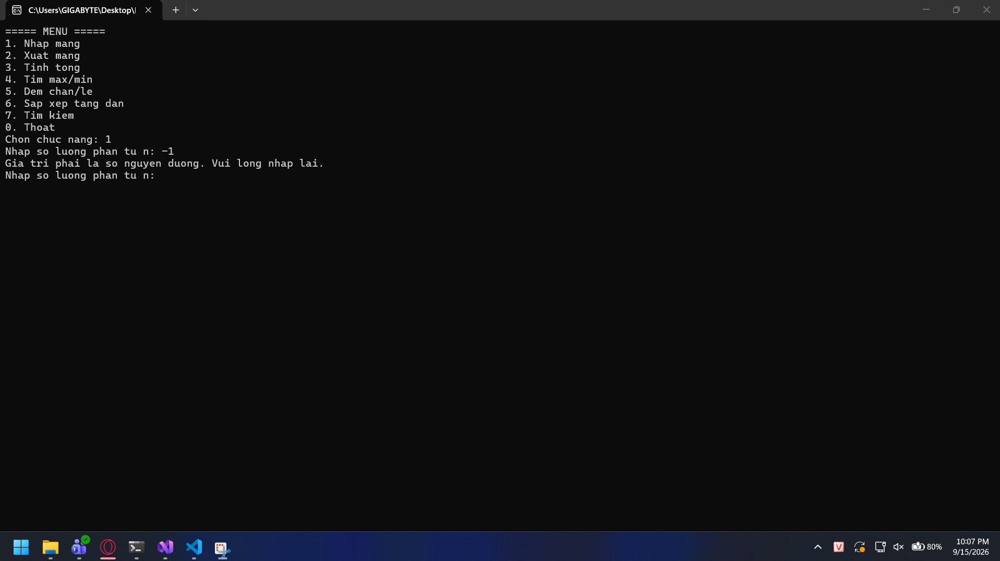
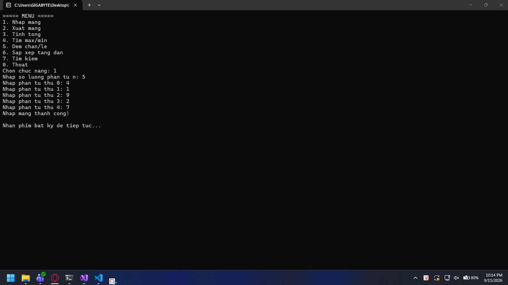
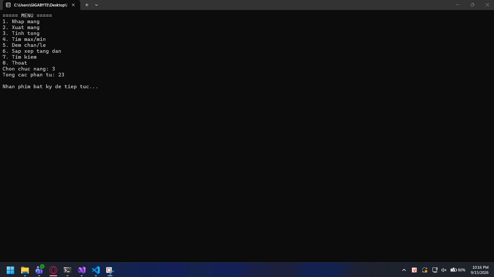
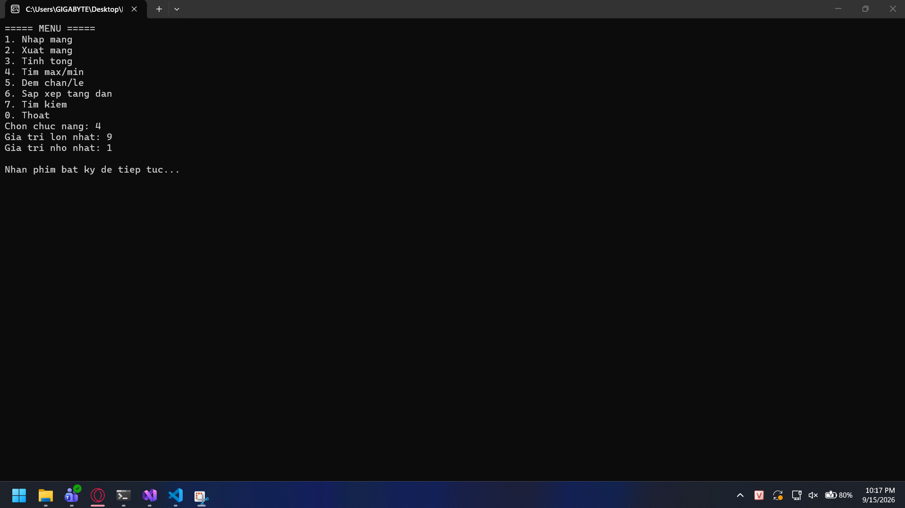
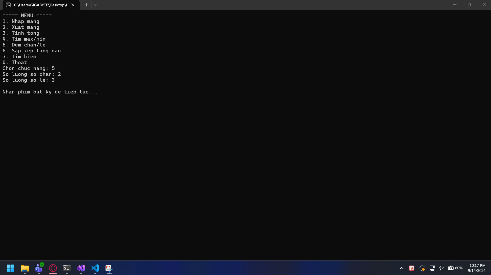
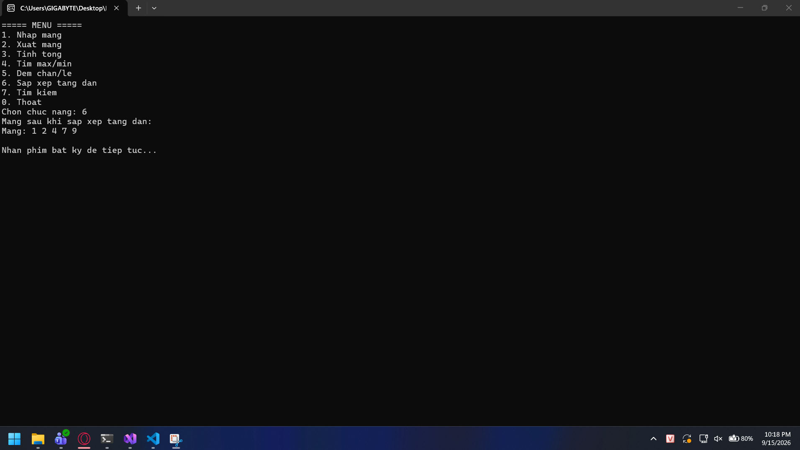
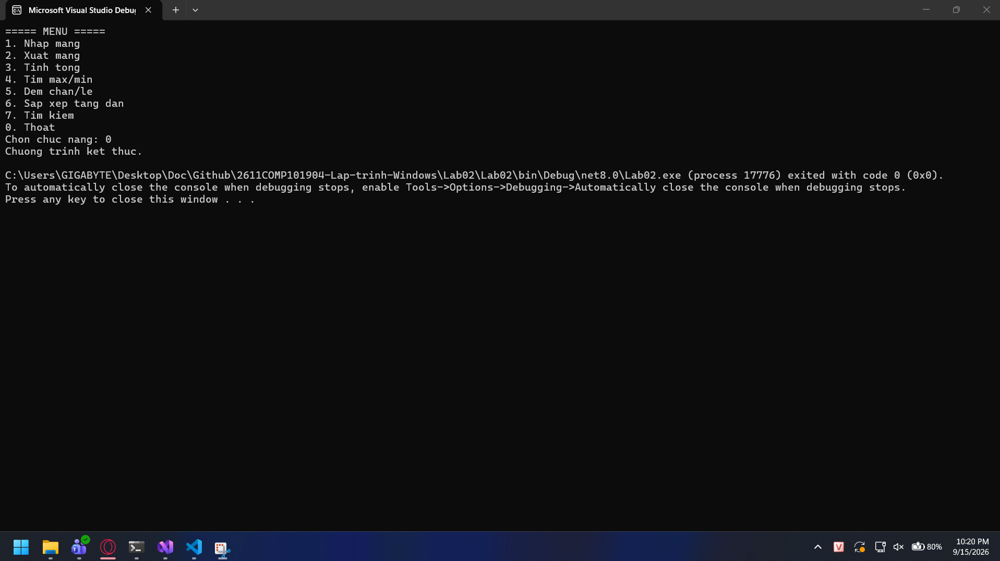

### Lab02 - C# cơ bản: Quản lý mảng số nguyên bằng Console

## Thông tin sinh viên
* **Họ tên:** Nguyễn Đan Trường
* **MSSV:** 51.01.104.110
* **Lớp:** 51.01.CNTT.A

## Mô tả
Ứng dụng Console App C# cho phép người dùng quản lý một mảng số nguyên thông qua menu lựa chọn chức năng, kèm kiểm tra ràng buộc dữ liệu đầu vào.

## Chức năng
* Nhập mảng: nhập số lượng phần tử n (phải là số nguyên dương) và n phần tử của mảng.
* Xuất mảng: in toàn bộ phần tử của mảng.
* Tính tổng: tính và in tổng các phần tử trong mảng.
* Tìm lớn nhất và nhỏ nhất: in giá trị lớn nhất và nhỏ nhất trong mảng.
* Đếm chẵn/lẻ: đếm số lượng phần tử chẵn và số lượng phần tử lẻ.
* Sắp xếp tăng dần: sắp xếp mảng theo thứ tự tăng dần và in kết quả.
* Tìm kiếm: nhập giá trị x, cho biết x có xuất hiện trong mảng hay không và vị trí xuất hiện đầu tiên.
* Thoát: kết thúc chương trình.

## Cách chạy
1. Mở project bằng Visual Studio (hoặc `cd Lab02` rồi chạy `dotnet run` bằng terminal).
2. Nhấn `F5` (hoặc nút Start) run code.

## Kết quả kiểm thử
* Mảng `4 1 9 2 7` → Tổng = 23, Max = 9, Min = 1, Chẵn = 2, Lẻ = 3
* Mảng `-3 0 8 -1` → Tổng = 4, Max = 8, Min = -3, Chẵn = 2, Lẻ = 2
* Tìm x = 9 trong `4 1 9 2 7` → tìm thấy tại vị trí 2 (tính từ 0)
* Tìm x = 5 trong `4 1 9 2 7` → không tìm thấy
* Nhập n = 0 hoặc n âm → chương trình yêu cầu nhập lại

## Hình ảnh minh họa chương trình

### 2.1. Kiểm tra các trường hợp bẫy lỗi

- **Cảnh báo khi chưa nhập mảng:**

- **Kiểm tra số lượng phần tử n âm hoặc bằng 0:**

- **Kiểm tra nhập sai lựa chọn chức năng:**

---

### 2.2. Dữ liệu thử nghiệm 5 phần tử: 4, 1, 9, 2, 7

- **Nhập và xuất mảng:**

- **Tính tổng các phần tử (Tổng = 23):**

- **Tìm Max/Min (Max = 9, Min = 1):**

- **Đếm số lượng chẵn/lẻ (Chẵn = 2, Lẻ = 3):**

- **Sắp xếp mảng tăng dần (1 2 4 7 9):**

---

### 2.3. Kiểm thử chức năng tìm kiếm và thoát

- **Tìm x = 9 (Có tìm thấy):**

- **Tìm x = 5 (Không tìm thấy):**

- **Thoát chương trình an toàn:**

