### Lab04 - Exception, Delegate/Event, Func/Action và Generic trong C#

## Thông tin sinh viên
- Họ tên: Nguyễn Đan Trường
- MSSV: 51.01.104.110
- Lớp: 51.01.CNTT.A

## Mô tả
Chương trình Console C# quản lý sản phẩm, dữ liệu lưu trong bộ nhớ bằng `Repository<T>` (generic, ràng buộc `where T : IEntity`). Lỗi nhập liệu, mã trùng và sản phẩm không tồn tại được xử lý bằng exception (2 exception tự tạo: `DuplicateProductException`, `ProductNotFoundException`). `ProductService` phát event khi thêm/xóa thành công và dùng `Func<Product, bool>` để tìm kiếm/lọc.

## Chức năng
- Thêm sản phẩm (kiểm tra mã rỗng, mã trùng, giá/số lượng không âm)
- Xuất danh sách sản phẩm
- Tìm theo mã
- Tìm theo tên (theo từ khóa)
- Lọc theo khoảng giá (dùng `Func<Product, bool>`)
- Xóa sản phẩm (phát event khi xóa thành công)
- Tính tổng giá trị kho

## Hình ảnh minh họa chương trình
### 1. Menu chính
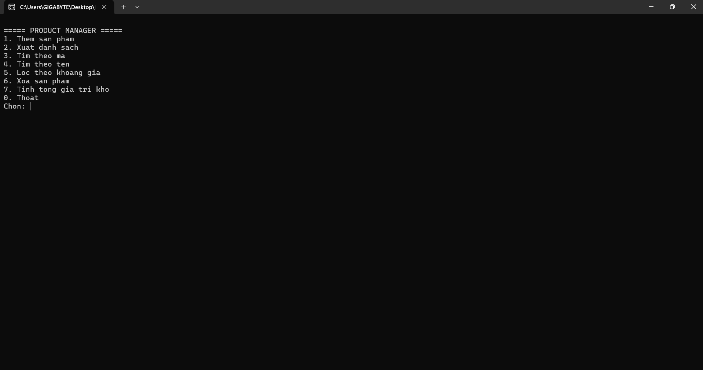

### 2. Thêm sản phẩm
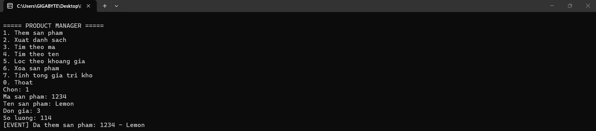

### 3. Xuất danh sách
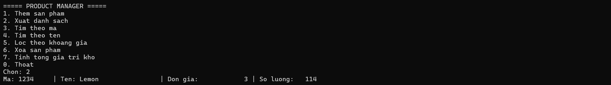

### 4. Tìm theo mã / tên
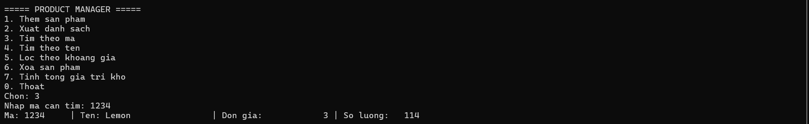
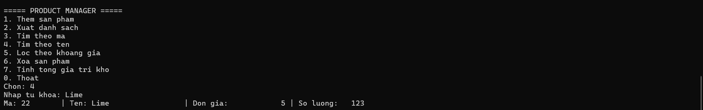

### 5. Lọc theo khoảng giá
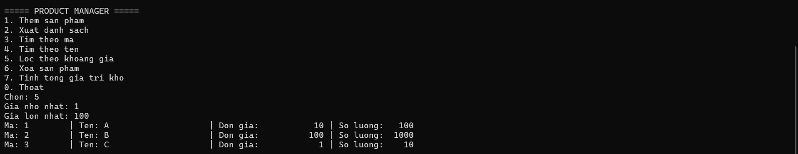

### 6. Xóa sản phẩm
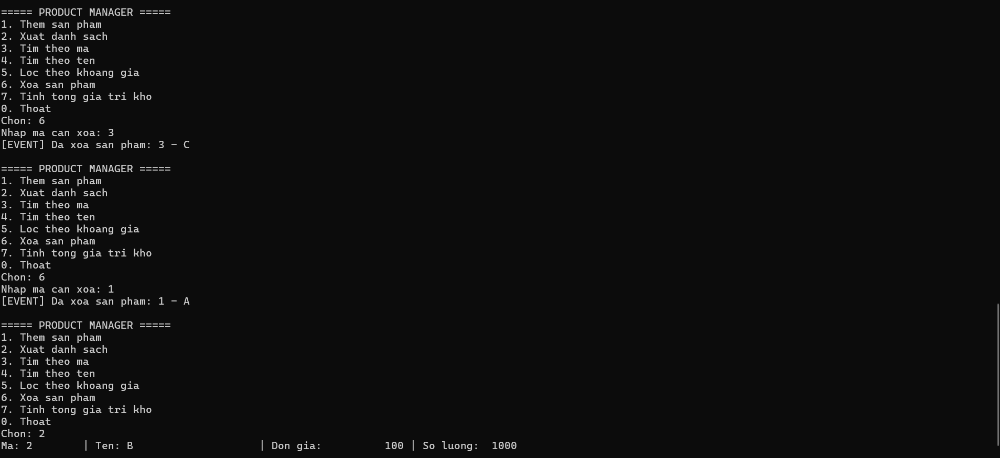

### 7. Tổng giá trị kho
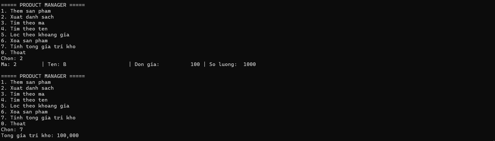

### 8. Xử lý lỗi (mã trùng, không tồn tại, nhập sai)
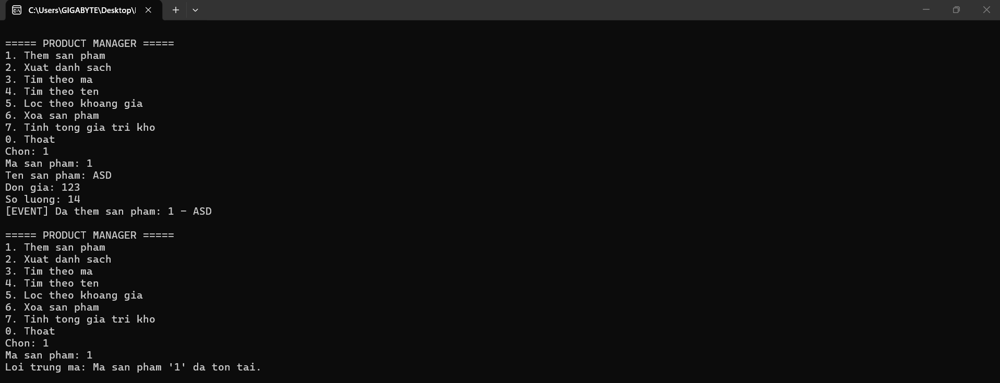
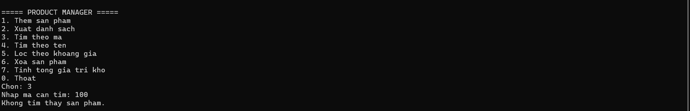
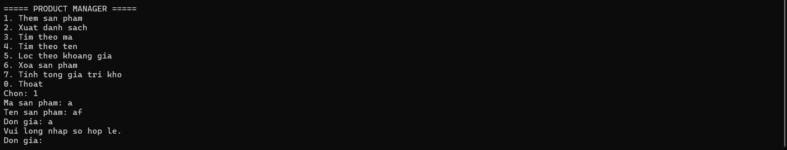

